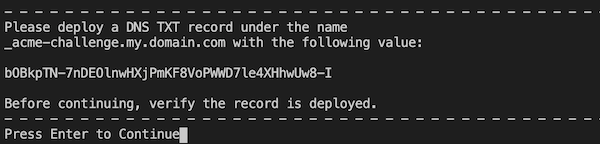

# Basic setup of https

A simple project to show the process of setting up https for a website. It shows how to generate a Let's Encrypt certificate using [`certbot`](https://certbot.eff.org/) and how to set-up this certificate in a nginx web server.

## Prerequisites

- Have VirtualBox installed.
- Have Vagrant installed.
- Have a web domain registered and access to control its DNS entries.

## Process overview

In order to secure a website with a certificate we would need to:

- request a certificate from a CA (certificate authority).
  - submit a certificate request containing the domain of the website we are securing.
  - prove ownership of this domain.

- Install the certificate for the webserver that serves the website.

## Building the demo environment

The repository contains a Vagrant project that will spin up a VM with nginx and `certbot` installed.

- Build the VM

```bash
vagrant up
```

- Login to the VM as root

```bash
vagrant ssh -c 'sudo su -'
```

## Requesting the SSL certificate

For the the demo we will request a free SSL certificate from the Let's Encrypt CA using the `certbot` utility.

- Register with Let's Encrypt. Run
  
  ```bash
  certbot register
  ```

  and follow the interactive prompts.

  Your Let's Encrypt account information will be placed in 
  
  `/etc/letsencrypt/accounts/acme-v02.api.letsencrypt.org/directory/`.

  In case you already have a Let's Encrypt registration files you can place them in the appropriate directory and skip this step.
  
  The root folder of this repository is synced to the `/vagrant` folder on the VM. This can be used to copy files between the VM and the host.

- Request a certificate.

  When requesting a web certificate for from a CA the requester must prove that they are indeed the owner of this web domain. Most commonly this is done in one of two ways:

  * DNS validation - the requester is asked to create a specific DNS record for the domain. The CA will provide the certificate once the existence of this record is confirmed.
  * HTTP validation - the requester is asked to place a file on the web server that can be reached via this domain. Once the the CA confirms that the file is served by the web server it issues the certificate.

  For this demo we will use `DNS` validation. Run

  ```bash
  certbot certonly --manual --preferred-challenges dns -d <your.domain.com>
  ```

  Follow the interactive prompts until the tool provides the validation DNS record and asks you create it. Output similar to

  

  At this point you need to create the requested dns record for `<your.domain.com>`, wait a few minutes to make sure that the record is active and then continue.

  Once the dns record is validated `certbot` it will place place the issued certificate keys in `/etc/letsencrypt/archive/<your.domain.com>/`.

## Configuring the web server to use the certificate

On the VM there is already a running nginx web server. We will create a new site and configure it to be served via HTTPS using the generated certificates.

- Create nginx site config

Edit the configuration template placed in `conf/site.config` relative to the root of this repository. Replace the placeholder values `<your.domain.com>` with the actual domain.

```nginx
server {
       listen 443 ssl;
        ssl_certificate      /etc/letsencrypt/archive/<your.domain.com>/cert1.pem;    # <-- replace <your.domain.com>
        ssl_certificate_key  /etc/letsencrypt/archive/<your.domain.com>/privkey1.pem; # <-- replace <your.domain.com>

       server_name <your.domain.com>;  # <-- replace <your.domain.com>

       # ...
}
```

- On the VM, as root, copy and enable the the edited nginx configuration.

```bash
cp /vagrant/conf/site.config /etc/nginx/sites-available/<your.domain.com>  # <-- replace <your.domain.com>

ln -s /etc/nginx/sites-available/<your.domain.com> /etc/nginx/sites-enabled/<your.domain.com>  # <-- replace <your.domain.com>

systemctl reload nginx.service
```

## Check if the site can be accessed via HTTPS

To confirm if the site can indeed be accessed via HTTPS we need a DNS record for `<your.domain.com>` that points to the web server on the VM. 

- Create an `A` DNS record for `<your.domain.com>` that points to `127.0.0.1`.

- In your browser open `https://<your.domain.com>`. The webpage will be displayed and the browser should report that it is using a valid certificate


